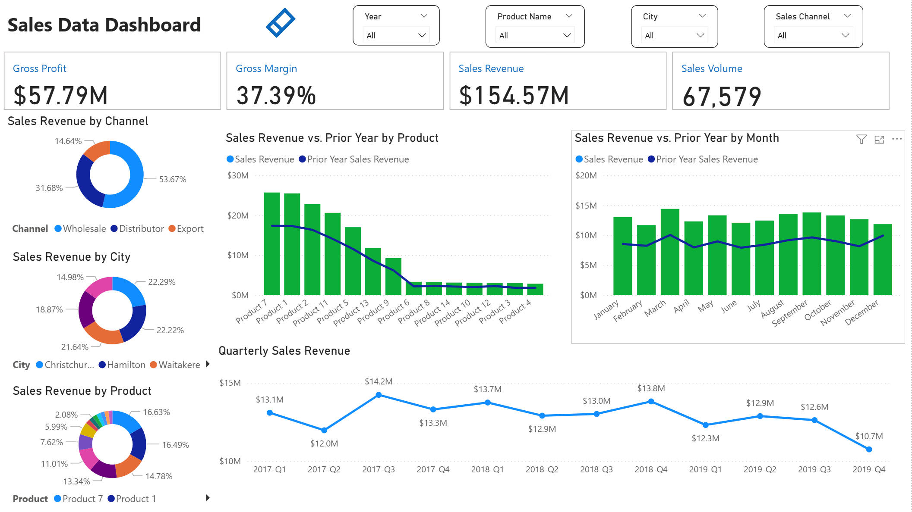
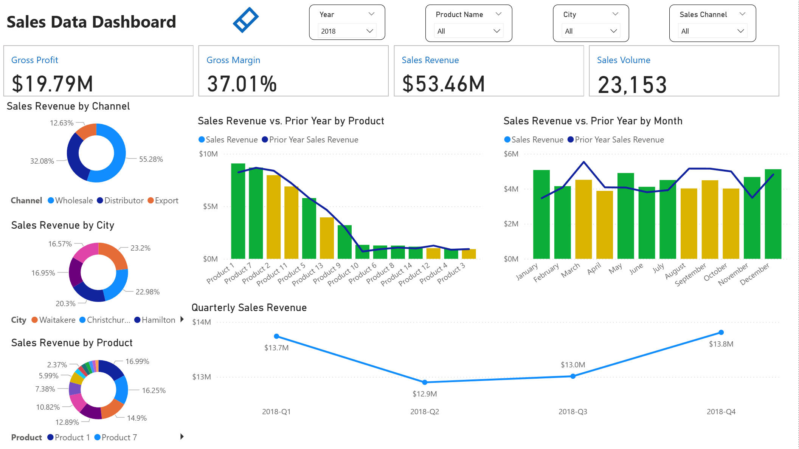
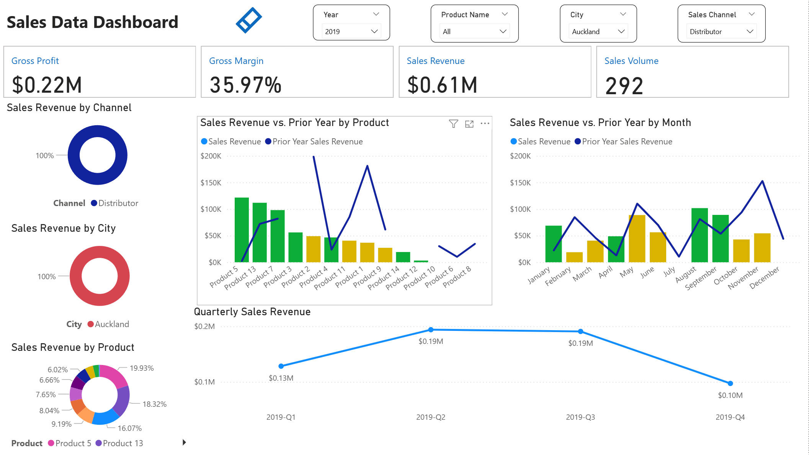
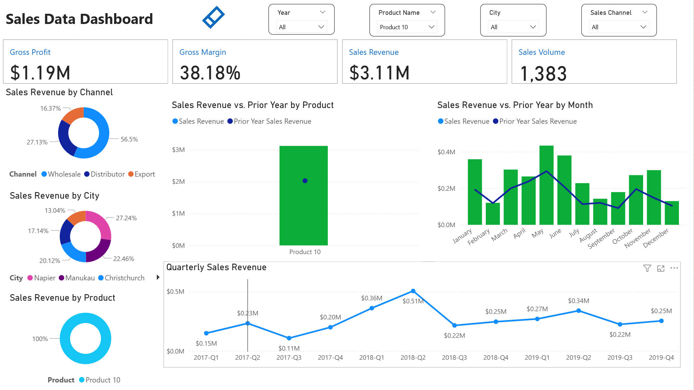

📊 Sales Data Dashboard

This project is a Power BI dashboard that provides an overview and analysis of company sales performance.
It highlights key KPIs and visualizes sales data across different dimensions such as channel, city, product, and time.

## Dashboard Preview

### KPI Filter Example

🔑 Key Features

1. KPI Cards

Gross Profit: Total profit after deducting sales costs.

Gross Margin: Profitability ratio that measures gross profit as a percentage of sales revenue.

Sales Revenue: Total revenue generated from sales.

Sales Volume: Total number of units sold.

2. Sales Revenue by Channel

Donut chart showing the share of revenue by sales channel (e.g., Wholesale, Distributor, Export).

Helps identify which channel contributes the most to revenue.

3. Sales Revenue by City

Donut chart displaying revenue contribution by city (e.g., Christchurch, Hamilton, Waitakere).

Useful for understanding geographic distribution of sales.

4. Sales Revenue by Product

Donut chart illustrating revenue distribution across different products.

Allows quick identification of top-performing products.

5. Sales Revenue vs. Prior Year by Product

Clustered column chart comparing current year sales revenue with prior year revenue for each product.

Provides visibility into product-level growth or decline.

6. Sales Revenue vs. Prior Year by Month

Column and line chart showing monthly revenue trends compared with the prior year.

Useful for detecting seasonal patterns and evaluating year-over-year performance.

7. Quarterly Sales Revenue

Line chart displaying sales revenue by quarter.

Helps track longer-term sales trends and quarterly fluctuations.

📌 Usage

The dashboard includes interactive slicers for Year, Product Name, City, and Sales Channel.

Users can filter and drill down into specific segments to analyze performance from multiple perspectives.

🚀 Future Improvements

Enhance visual formatting for improved storytelling.

Publish interactive version to Power BI Service for live demo.
